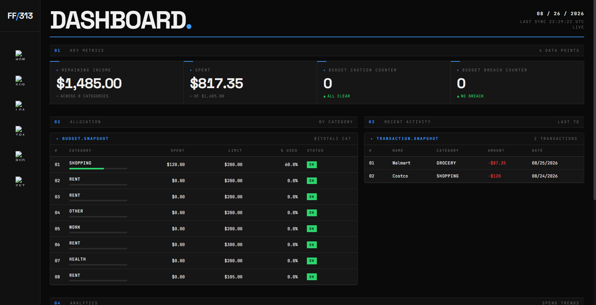
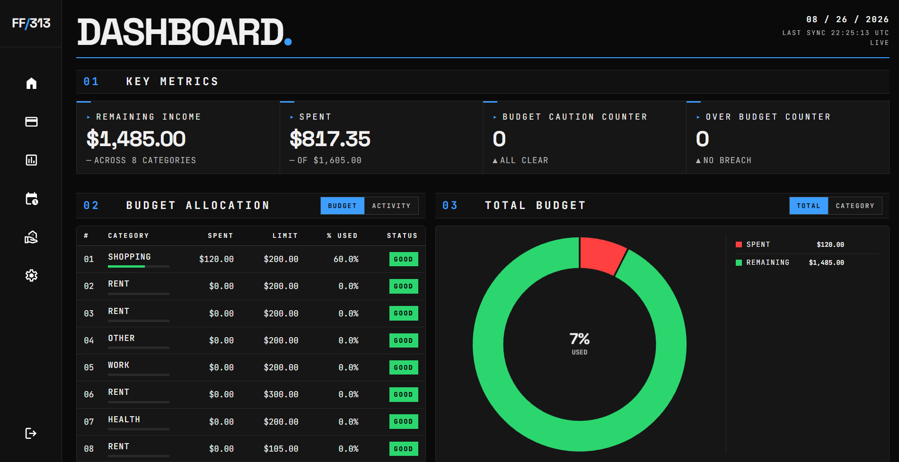

# Personal Finance Website

_Collaborative team project for Software Development with Frameworks at North Dakota State University._

A personal finance tracker built with Angular and Firebase. It handles transactions, budgets, subscriptions, and loans, all from one dashboard.

## Features

- **Authentication**: Sign up, log in, log out, and reset your password through Firebase Auth. Route guards keep the protected pages locked to signed-in users.
- **Dashboard**: Budget and transaction snapshots with charts, so you can see where things stand at a glance.
- **Transactions**: Add, edit, and delete income or expense entries, and tag each one with a category.
- **Budgets**: Set a budget per category and watch it update in real time through Firestore.
- **Subscriptions**: Track recurring subscriptions and when they bill next.
- **Loans**: Track loan balances and see a payoff estimate based on the interest rate and payment amount.
- **Settings**: Update your profile info or change your password.

## Demo

- **Original Group Project:** [](https://cohenreiland.github.io/frameworks-final-project/)

- **Improved Version:** [](https://cohenreiland.github.io/personal-finance-website)

## Tech Stack

- Angular 21
- TypeScript 5.9
- Firebase (Authentication + Firestore)
- Chart.js + ng2-charts
- Bootstrap 5

## Getting Started

### Prerequisites

You'll need Node.js 20 or later with npm, plus a Firebase project with Email/Password authentication and Firestore turned on.

### Setup

First, clone the repository and install dependencies:

```bash
npm install
```

Then add your Firebase project's config to `src/app/firebase.config.ts`. If you don't already have those values, Firebase's [web setup docs](https://firebase.google.com/docs/web/setup) show you where to find them in your Firebase console.

Once that's done, start the dev server:

```bash
npm start
```

and open [http://localhost:4200](http://localhost:4200) in your browser.

### Build for Production

```bash
npm run build
```

This outputs the build to `dist/`.

## Usage

Once you're logged in, the dashboard gives you a quick read on your budget usage and recent transactions. From there, transactions let you log income and expenses and sort them by category, budgets let you set spending limits per category, and subscriptions and loans let you track recurring costs and payoff progress. Settings is where you update your profile or password.

All data is scoped to the signed-in user through Firestore security rules, so no one can read or write another user's data.

## Project Structure

```
src/app/
├── login-component/       # Login page
├── sign-up-component/     # Sign-up page
├── settings-component/    # Profile & password settings
├── navbar/                # App sidebar navigation
├── pages/
│   ├── dashboard/          # Dashboard with charts + snapshots
│   └── budget/              # Budget management page
├── loan/                  # Loan tracking page
├── subscription/          # Subscription tracking page
├── transaction-list/      # Transaction list & CRUD
├── transaction-item/      # Single transaction row
├── transaction-snapshot/  # Dashboard transaction summary
├── budget-snapshot/       # Dashboard budget summary
├── services/               # Firebase-backed data services
├── models/                 # TypeScript interfaces for app data
├── app.routes.ts            # Route definitions + auth guards
└── firebase.config.ts        # Firebase project configuration
```

## Improvements

This project started as a team assignment, and it was left in a working but rough state once the course ended. Since then it's been reworked and improved.

The database turned out to be the biggest problem. Firestore's rules were still set to `allow read, write: if true`, so anyone who found the project ID could read or wipe the entire database. That's fixed now, with rules that scope every user's data to their own account.

There were a couple of access-control gaps too. The dashboard and subscription pages were reachable without logging in, when every other page required it.

Past the fixes, the UI got a consistency pass across transactions, budgets, loans, subscriptions, and the dashboard, plus a rework of the dashboard's charts. The codebase itself got cleaned up too: dead code and unused imports removed, debug statements pulled out, naming conventions normalized, and Prettier wired in for consistent formatting.

## License

MIT License. See [LICENSE](LICENSE) for details.

## Team

Collaborative team project for Software Development with Frameworks at North Dakota State University.
